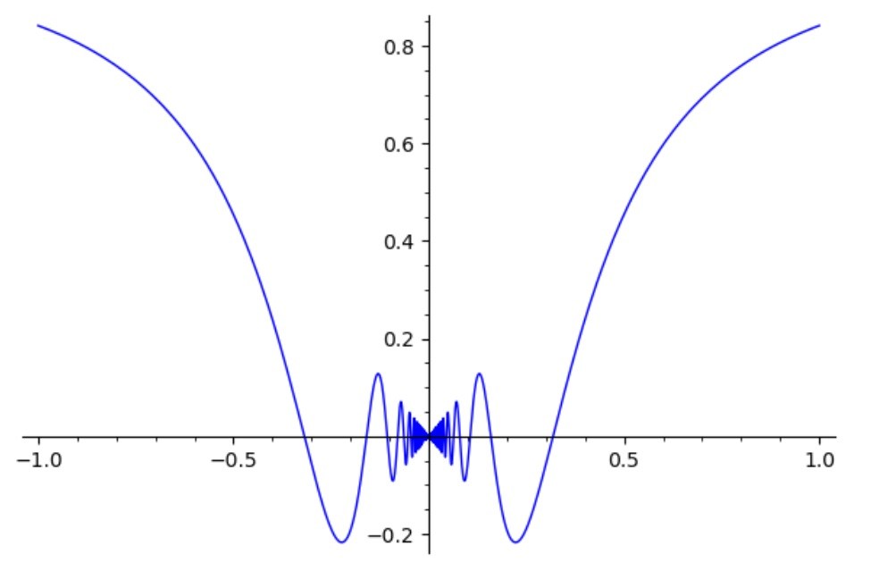
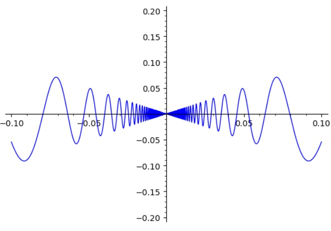
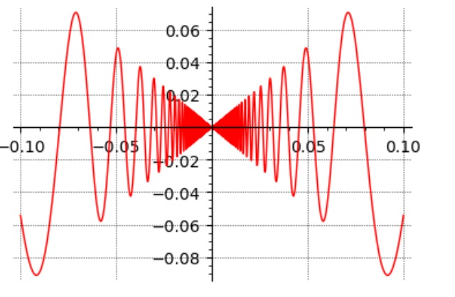
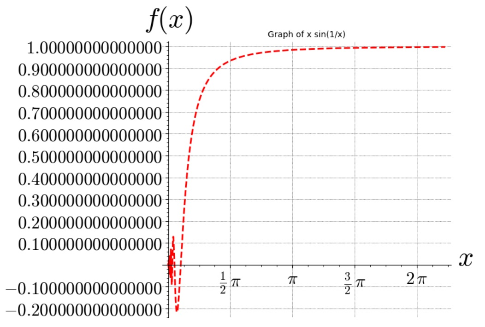
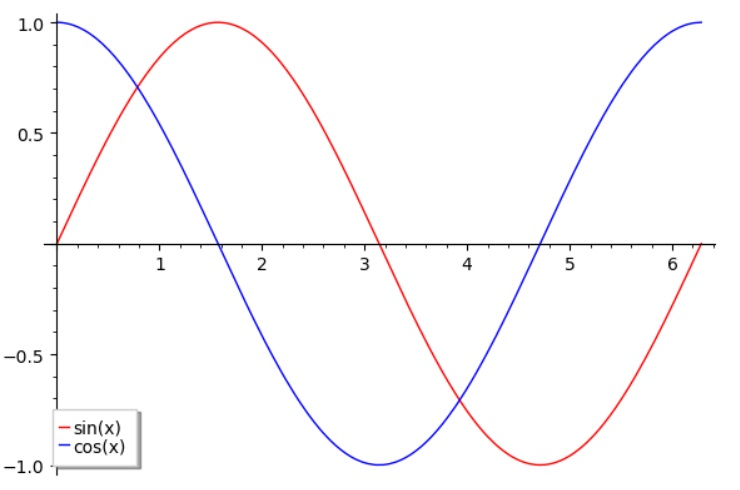
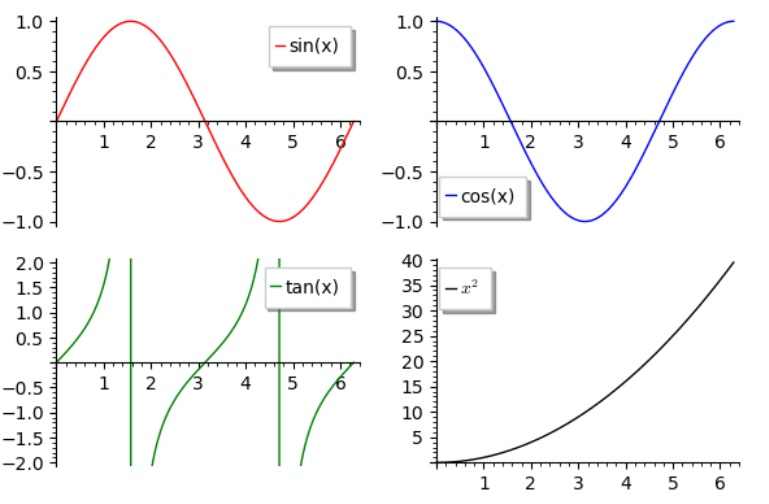
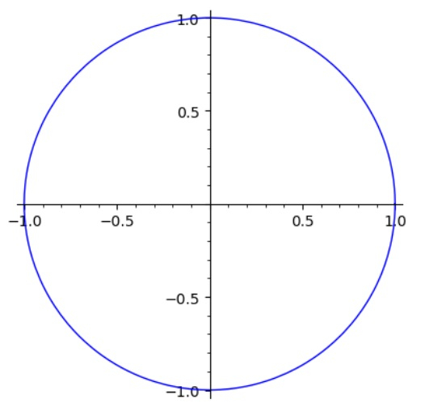
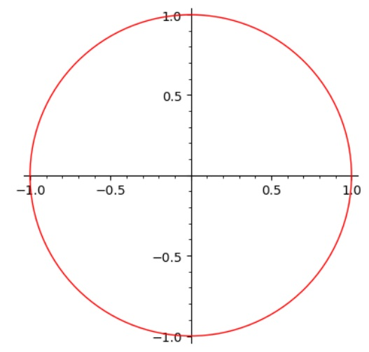

# Chapter 1: Installation and initial setup

## 1.1: Installation

Read the official documentation for installation [here](https://doc.sagemath.org/html/en/installation/index.html)

## 1.2: Initial setup

After downloading and installing SageMath, three shortcuts are created on your desktop.

- SageMath console (start typing sageamth commands here)
- SageMath notebook (open jupyter notebook with sage kernel)
- SageMath shell (a normal shell but with sageMath recognized)

To work with SageMath, you can use any of the three shortcuts. I prefer using the SageMath notebook. However i don't recommend launching the SageMath notebook from the shortcut. Instead, To keep things well organized open the SageMath shell and type the following commands:

```bash
$ mkdir my-sagemath-new-project
$ cd my-sagemath-new-project
$ sage -n jupyter
```

This will open a jupyter notebook with the sage kernel. in that directory. Not in the default directory. This is important to organize your work.

# Chapter 2: SageMath basics

SageMath is built on top of Python. So, if you know Python, you already know how to write valid SageMath. Every python code is a valid SageMath code. We can do something that is entirely not related to SageMath and it will still work. For example:

We can make a hello world flask app and it will work.

```python
from flask import Flask
app = Flask(__name__)

@app.route('/')
def hello_world():
    return 'Hello, World!'
```

This is one of the greatest advantages of SageMath. It is built on top of Python. So, we can use all the features of Python and integrate any functionality we want.

However, SageMath is a mathematical software. So, we will be using it to do mathematical stuff and has some extra features that are not available in Python. These features are the reason why we use SageMath instead of Python.

## 2.1: SageMath as a calculator

### Assignment, Equality, and Arithmetic

```python
sage : x = 2
sage : y = 3
sage : x > y
False
sage : x < y
True
sage : x == y
False
sage : x != y
True
```

### Basic mathematical operations

SageMath is a calculator. It can do basic arithmetic operations. For example:

```python
sage : 2 + 2
4
sage : 9 - 3
6
sage : 4 / 2
2
sage : 2 ^ 3 # Not a valid python code
8
sage : 2 ** 3 # Valid python code
8
sage : 2 ^ 2.
4.00000000000000
sage : 2 ^ 2.1
4.28709385014517
sage : 22 // 7 # integer division
3
sage : 22 % 7 # modulus
1
```

### Predefined constants

Also sageMath comes with a lot of predefined constants. For example:

```python
sage : pi
pi
```

To show the numerical value of a constant, we can use the `n()` function. (an optional parameter is `digits`) For example:

```python
sage : pi.n()
3.14159265358979
sage : pi.n(digits=5)
3.1416
sage : n(pi)
3.14159265358979
sage : e.n()
2.71828182845905
sage : i
I
```

### Trigonometric functions

```python
sage : sin(pi)
0
sage : cos(2) # note that is uses radians
cos(2)
sage : cos(2).n()
-0.416146836547142
sage : tan(5).n()
-3.38051500624659
sage : arctan(1)
1/4*pi
sage : arccos(1)
0
sage : arcsin(1).n()
1/2*pi
```

### Exponential and logarithmic functions

```python
sage : exp(1)
e
sage : exp(1).n()
2.71828182845905
```

So lets do something mindblowing

```python
sage : exp(x^2 + log(x))
e^(x^2 + log(x))
sage : exp(x^2 + log(x)).simplify()
x*e^(x^2)
```

That is actually true

```math
e^{x^2 + \log(x)} = e^{x^2} e^{\log(x)} = x e^{x^2}
```

Note that sageMath was able to simplify the expression symbolically. This is one of the greatest features of sageMath. It can simplify expressions symbolically. This is not possible in Python.

Logarithmic functions are also available. For example:

```python
sage : log(2)
log(2)
sage : log(2).n()
0.693147180559945 # default base is e
sage : log(2, e) # log base e
0.693147180559945
sage : ln(2) # ln and log are the same in sage
0.693147180559945
sage : log(128, 2)
7
```

### Other functions

```python
sage : sqrt(2)
sqrt(2)
sage : sqrt(2).n()
1.41421356237310
sage : factorial(5)
120
```

## 2.2 Data types

```python
sage : type(2)
<class 'sage.rings.integer.Integer'>
sage : type(2.0)
<class 'sage.rings.real_mpfr.RealLiteral'>
sage : type(2.0 + 3.0*I)
<class 'sage.symbolic.expression.Expression'>
sage: type(pi)
<class 'sage.symbolic.expression.Expression'>
sage: type(pi.n())
<class 'sage.rings.real_mpfr.RealNumber'>
sage : type('hello')
<class 'str'>
sage : type(True)
<class 'bool'>
```

## 2.3 Basic integer operations

```bash
sage: number = 7109
sage: number.is_prime()
True
sage: number.next_prime()
7121
sage: number.previous_prime()
7103
sage: number.divisors()
[1, 7109]
sage: divisors(7642)
[1, 2, 3821, 7642]
sage: number.digits()
[9, 0, 1, 7]
sage: number.ndigits()
4
sage: factor(7642)
2 * 3821
sage: factor(76420) # factorization of a number
2^2 * 5 * 3821
sage: show(sqrt(7))
\sqrt{7}
```

if you are working in jupyter notebook (note the console), the latest command `show` will output the actual representation

```python
sage: show(sqrt(7))
```

```math
\sqrt{7}
```

Show some complex expressions

```python
sage : show(integrate(x^2 + 2*x + 1, x))
```

```math
\frac{1}{3} \, x^{3} + x^{2} + x
```

# Chapter 3 : Basic Algebra and Calculus

## 3.1 Solving equations

```python
sage : f(x) = x^2 + x - 1
sage : f(x)
x^2 + x - 1
sage : f(2)
5
sage : show(f(x))
```

```math
x^{2} + x - 1
```

```python
sage : latex(f(x))
x^{2} + x - 1
sage : solve(f(x) == 0, x)
[x == -1/2*sqrt(5) - 1/2, x == 1/2*sqrt(5) - 1/2]
sage: solve(f(x) == 0, x, solution_dict=True)
[{x: -1/2*sqrt(5) - 1/2}, {x: 1/2*sqrt(5) - 1/2}]
sage : type(f)
<class 'sage.symbolic.expression.Expression'>
```

```python
sage : var('a, b, c')
(a, b, c)
sage : sol = solve(a*x^2 + b*x + c == 0, x); sol
[x == -1/2*(b + sqrt(b^2 - 4*a*c))/a, x == -1/2*(b - sqrt(b^2 - 4*a*c))/a]
sage : show(sol)
```

```math
\left[x = -\frac{b + \sqrt{b^{2} - 4 \, a c}}{2 \, a}, x = -\frac{b - \sqrt{b^{2} - 4 \, a c}}{2 \, a}\right]
```

```python
sage : var('x, y')
(x, y)
sage : solve([x + y == 6, x - y == 4], [x, y])
[[x == 5, y == 1]]
sage : solve([x + y == 5], x, y)
[[x == -r3 + 5, y == r3]]
sage : sol = solve([x^2 + y^2 == 4, x*y == 2], x, y); show(sol)
```

```math
\left[\left[x = -\sqrt{2}, y = -\sqrt{2}\right], \left[x = \sqrt{2}, y = \sqrt{2}\right]\right]
```

Solving inequalities

```python
sage : solve(x^-2 * x - 1, x)
[[x > 0, x < (1/9)]]
```

## 3.2 Differentiation

```python
sage : f(x) = x^2 + 2*x + 1
sage : show(f.diff())
```

```math
x \ {\mapsto}\ 2 \, x + 2
```

Compute the first derivative

```python
sage : var('u')
u
sage : diff(sin(u), u)
cos(u)
```

Compute the fourth derivative

```python
sage : diff(sin(x^2), x, 4).show()
```

```math
16 \, x^{4} \sin\left(x^{2}\right) - 48 \, x^{2} \cos\left(x^{2}\right) - 12 \, \sin\left(x^{2}\right)
```

Compute partial derivatives of $x^2 + 17 y^2$ with respect to $x$ and $y$.

```python
sage : var('x, y')
(x, y)
sage : f = x^2 + 17*y^2
sage : f.diff(x)
2*x
sage : f.diff(y)
34*y
```

## 3.3 Integration

sage supports both indefinite and definite integrals

```python
sage : integral(x*sin(x^2), x).show()
```

```math
-\frac{1}{2} \, \cos\left(x^{2}\right)
```

```python
sage : integral(x/(x^2+1), x, 0, 1).show()
```

```math
\frac{1}{2} \, \log\left(2\right)
```

When `solve` fails, you can use `find_root` to find a root of a numerical solution

```python
sage: theta = var('theta')
sage: solve(cos(theta)==sin(theta), theta) # Nothing interesting here
[sin(theta) == cos(theta)]
sage: find_root(cos(theta)==sin(theta), 0, pi/2) # find a solution in the interval [0, pi/2]
0.7853981633974484
sage: sol = find_root(cos(theta)==sin(theta),0,pi/2); sol
0.7853981633974484
sage: sin(sol)
0.7071067811865476
sage: cos(sol)
0.7071067811865475
```

# Chapter 4 : Plotting

## 4.1 2D Plots

```python
sage : f(x) = x*sin(1/x)
sage : f.plot()
```



to plot a function over a specific interval:

```python
sage : plot(f, (x, -0.1, 0.1), ymin = -0.2, ymax = 0.2)
```



there are countless options to customize the plot, for example:

```python
sage : plot(f, (x, -0.1, 0.1), figsize = 4, color = 'red', gridlines = True)
```



More customization:

```python
p  = plot(f, (x, 0, 7),
     ymin = -0.2,
     ymax = 1,
     figsize = 8,
     color = 'red',
     gridlines = True,
     thickness = 2,
     linestyle = '--',
     title = 'Graph of x sin(1/x)',
     axes_labels=['$x$', '$f(x)$'],
     ticks = [pi/2, 0.1],
     tick_formatter = [pi/2, 0.1]
     )

p.fontsize(21)
p
```



combine multiple plots:

```python
sage : p1 = plot(sin(x), (x, 0, 2*pi), color = 'red', legend_label = 'sin(x)')
sage : p2 = plot(cos(x), (x, 0, 2*pi), color = 'blue', legend_label = 'cos(x)')
sage : p1 + p2
```



4 plots in one figure: (4 x 4 grid)

```python
sage : p1 = plot(sin(x), (x, 0, 2*pi), color = 'red', legend_label = 'sin(x)')
sage : p2 = plot(cos(x), (x, 0, 2*pi), color = 'blue', legend_label = 'cos(x)')
p3 = plot(tan(x), (x, 0, 2*pi), ymin = -2, ymax = 2, color = 'green', legend_label = 'tan(x)')
sage : p4 = plot(x^2, (x, 0, 2*pi), color = 'black', legend_label = '$x^2$')
sage : graphics_array(((p1,p2), (p3,p4)))
```



Parametric plots:

```python
sage : parametric_plot((cos(x), sin(x)), (x, 0, 2*pi))
```



custom shape:

```python
circle((0,0), 1, rgbcolor=(1,0,0)) # center (0,0), radius 1, color red
```



For more information, see [here](https://doc.sagemath.org/html/en/reference/plotting/sage/plot/plot.html), you will be amazed by the number of options you can use to customize your plots.
